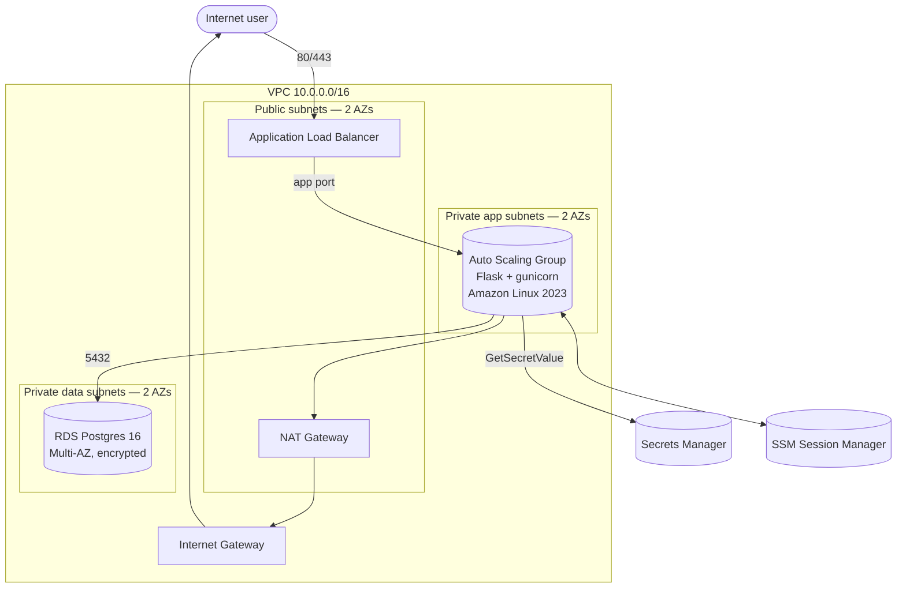

# AWS three-tier web stack — Terraform

A complete, production-shaped AWS environment defined entirely in Terraform: VPC across two AZs, an Application Load Balancer in front of an Auto Scaling Group running a Flask app, a Multi-AZ RDS Postgres backend, credentials in Secrets Manager, SSM Session Manager for shell access, and CloudWatch alarms for the things that matter.

Built as a portfolio / interview-prep project: each design decision is intentional and explained in [`docs/DECISIONS.md`](docs/DECISIONS.md).

## Architecture



Full diagram + traffic flow + table of subnet CIDRs in [`docs/ARCHITECTURE.md`](docs/ARCHITECTURE.md).

## What you get

| Layer        | What's running                                                                  |
| ------------ | ------------------------------------------------------------------------------- |
| Networking   | VPC, IGW, NAT, 6 subnets across 2 AZs, route tables                             |
| Edge         | ALB on port 80 with `/health` target group health checks                        |
| Compute      | ASG of Amazon Linux 2023 instances running a Flask app under gunicorn + systemd |
| Data         | RDS Postgres 16, Multi-AZ, encrypted storage, automated backups                 |
| Secrets      | Secrets Manager + IAM least-privilege read from the instance role               |
| Ops          | SSM Session Manager (no bastion), CloudWatch alarms, optional SNS email         |
| State        | S3 backend with DynamoDB locking (separate bootstrap stack)                     |
| CI           | GitHub Actions workflow: `fmt -check`, `validate`, optional plan-on-PR via OIDC |

## Repo layout

```
.
├── bootstrap/           # One-time stack: S3 bucket + DynamoDB lock table
│   ├── main.tf
│   └── versions.tf
├── infra/               # The main stack
│   ├── versions.tf
│   ├── providers.tf
│   ├── backend.tf
│   ├── variables.tf
│   ├── locals.tf
│   ├── vpc.tf
│   ├── subnets.tf
│   ├── routing.tf
│   ├── security_groups.tf
│   ├── iam.tf
│   ├── alb.tf
│   ├── asg.tf
│   ├── rds.tf
│   ├── secrets.tf
│   ├── monitoring.tf
│   ├── outputs.tf
│   ├── user_data.sh.tpl
│   └── terraform.tfvars.example
├── docs/
│   ├── ARCHITECTURE.md  # Diagram + traffic flow
│   ├── DECISIONS.md     # Why each choice was made
│   └── COSTS.md         # Monthly cost estimate
├── .github/workflows/terraform.yml
├── Makefile
├── .gitignore
└── .terraform-version
```

## Prerequisites

- An AWS account with admin (or equivalent) credentials configured locally — `aws sts get-caller-identity` should work.
- Terraform 1.6+ (`brew install hashicorp/tap/terraform`).
- `make`, `curl`, `jq` for the convenience targets.

## Quickstart

```bash
# 1. One-time: stand up the remote-state backend.
make bootstrap

# 2. Wire infra/ to that backend.
make init

# 3. (Optional) Copy the example tfvars and edit.
cp infra/terraform.tfvars.example infra/terraform.tfvars

# 4. Plan + apply.
make plan
make apply
```

When the apply finishes (RDS first-create takes 5-10 min — that's most of the wait):

```bash
# Hit the load balancer.
make hit

# Shell into a private instance via SSM.
make ssm

# Tear it all down when you're done so it stops billing.
make destroy
```

## What `make hit` returns

```json
{
  "service": "aws-portfolio app",
  "hostname": "ip-10-0-10-42.ec2.internal",
  "instance_id": "i-0abc...",
  "az": "us-east-1a",
  "now_utc": "2026-04-25T17:42:01+00:00",
  "db": {
    "host": "aws-portfolio-dev-db.xxxx.us-east-1.rds.amazonaws.com",
    "name": "appdb",
    "status": "connected",
    "version": "PostgreSQL 16.3",
    "server_time": "2026-04-25T17:42:01+00:00"
  }
}
```

Refresh — `hostname`, `instance_id`, and `az` change as the ALB rotates instances. `db.status: "connected"` proves the app, the IAM role, the secret, the security group rules, and the RDS instance are all wired correctly.

## Verifying without applying

You can statically check the entire stack with no AWS calls and no spend:

```bash
make fmt validate
```

That runs `terraform fmt -check` over everything, then `terraform init -backend=false` + `terraform validate` for both stacks. CI runs the same checks on every PR.

## Cost

Roughly **$95-105/month idle** in `us-east-1` with defaults. Free tier covers a chunk of EC2 and RDS. Full breakdown and tips for keeping it near zero in [`docs/COSTS.md`](docs/COSTS.md).

## Common questions 

> "Walk me through what happens when a request hits the ALB."

The ALB is in the public subnets, so it has a path through the IGW from the internet. It evaluates listener rules and forwards to the target group on the app port. The target group contains EC2 instances registered by the ASG, all in private app subnets. Those instances accept traffic only from the ALB's security group — the SG references the ALB SG by ID, not CIDR. Inside the instance, gunicorn passes the request to Flask, which (for `/`) reads the DB credentials from Secrets Manager via the instance role and queries RDS over a private network path. The response goes back up the chain.

> "Why three subnet tiers?"

So the DB security group can allow port 5432 only from the *app SG*, not from "anything in the VPC." See [`docs/DECISIONS.md`](docs/DECISIONS.md) for the rest.

> "How do you patch / shell into instances?"

SSM Session Manager. No bastion, no SSH keys, no inbound port. Audited via CloudTrail. The instance role grants `AmazonSSMManagedInstanceCore`; the agent ships in Amazon Linux 2023.

> "What happens if an AZ goes down?"

ALB stays up (multi-AZ by definition). ASG keeps the surviving AZ's instances and tries to launch replacements; with `single_nat_gateway = true` those launches will fail because the NAT in the dead AZ is gone. RDS Multi-AZ promotes the standby in the surviving AZ; the endpoint stays the same so the app reconnects without code changes. To survive a NAT-AZ outage cleanly, flip `single_nat_gateway = false`.

> "Show me where the password lives."

It doesn't live anywhere I typed it. `random_password.db` generates a 32-char string at apply time. The RDS resource takes it directly; `aws_secretsmanager_secret_version.db` writes it to Secrets Manager as a JSON blob. The instance role has IAM that allows `GetSecretValue` on exactly that one secret ARN, not `*`. The Flask app pulls it on first request and caches the parsed creds.
