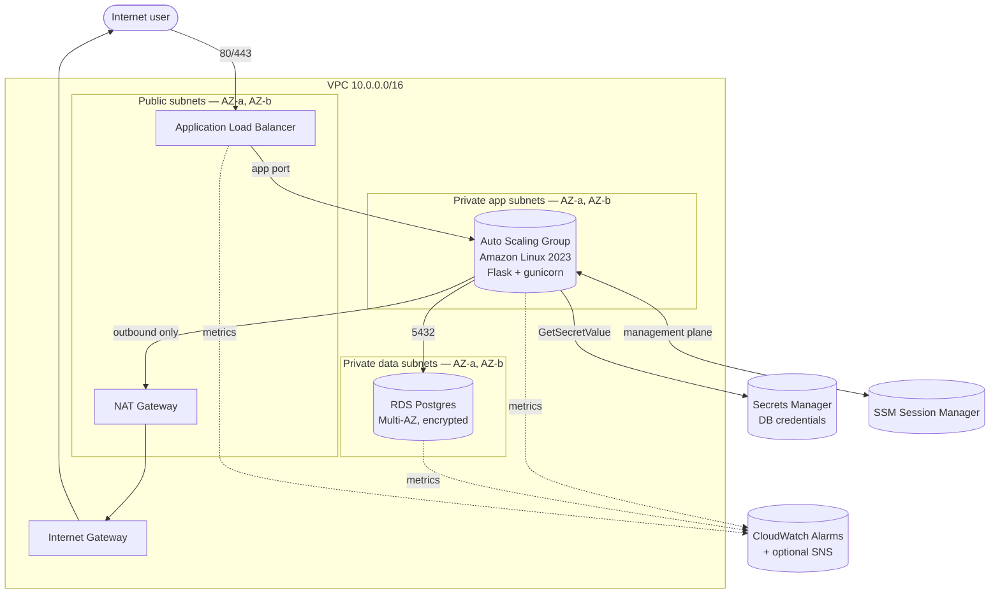

# Architecture

A minimal but production-shaped three-tier web stack on AWS, defined entirely in Terraform.

## Diagram

## What's in the VPC

Two availability zones. Three subnet tiers per AZ:

| Tier        | CIDRs                       | Routing                | Holds                  |
| ----------- | --------------------------- | ---------------------- | ---------------------- |
| Public      | 10.0.0.0/24, 10.0.1.0/24    | 0.0.0.0/0 → IGW        | ALB, NAT Gateway       |
| Private app | 10.0.10.0/24, 10.0.11.0/24  | 0.0.0.0/0 → NAT        | EC2 instances (ASG)    |
| Private data| 10.0.20.0/24, 10.0.21.0/24  | 0.0.0.0/0 → NAT        | RDS                    |

The CIDRs are computed with `cidrsubnet()` from `var.vpc_cidr`, so you can re-point this entire stack at a different /16 without editing each subnet by hand.

## Traffic flow

1. A request hits the ALB on port 80 (HTTPS-ready — listener can be added without an SG change).
2. The ALB forwards to a target group on the app port (default 8080) in the private app subnets.
3. The Flask app on each instance:
   - Pulls DB credentials from Secrets Manager via the instance role.
   - Connects to RDS over the VPC's private network.
   - Returns instance metadata + DB version + DB time as JSON. Refresh the page to see the load balancer hand requests to different instances.
4. CloudWatch alarms watch ASG CPU, ALB target health, RDS CPU, and RDS free storage. With `alarm_email` set, breaches go to SNS → email.

## Security posture

- Security groups are layered: ALB takes the internet, app SG only takes the ALB SG, DB SG only takes the app SG. Each layer is referenced by SG ID, not CIDR — so rules survive scale-out.
- IMDSv2 is enforced on every instance (`http_tokens = required`).
- The DB master password is generated by Terraform's `random_password` and never written to tfvars. It lives in Secrets Manager; the app reads it via least-privilege IAM (single secret ARN, not `*`).
- RDS is in private data subnets with `publicly_accessible = false`. Storage is encrypted with the AWS-managed KMS key.
- No bastion host. Operators reach private instances through SSM Session Manager (audited, no inbound ports). The SSM agent ships in Amazon Linux 2023 by default.
- The state backend bucket has versioning, SSE, and full public-access blocks.

## High availability choices

| Layer | What gives you HA                                        |
|-------|-----------------------------------------------------------|
| ALB   | AWS-managed, multi-AZ by definition (subnets in 2 AZs).   |
| ASG   | `min_size = 2`, instances spread across 2 AZs.            |
| RDS   | `multi_az = true` — synchronous standby, automatic failover.|
| State | S3 (11 9's) + DynamoDB lock table.                        |

The one HA compromise: `single_nat_gateway = true` saves about $32/month. A single-AZ outage breaks egress for private subnets in the *other* AZ, which means the ASG can't pull updates / read Secrets Manager from there. Acceptable for `dev`. For `prod`, flip the flag — Terraform fans out one NAT per AZ and routes accordingly.

## What's not in here (yet)

These are the next things you'd add when this graduates from "portfolio" to "real":

- HTTPS listener with an ACM cert and an optional Route53 alias record.
- WAF on the ALB.
- VPC Flow Logs to CloudWatch / S3.
- VPC interface endpoints for SSM + Secrets Manager so private subnets can reach those services without traversing NAT (and so the ASG works during AZ-level NAT outages).
- A proper application — this one only proves the wiring.
- Blue/green or canary deploys via CodeDeploy (the ASG already has rolling instance refresh, which is enough for a portfolio).
